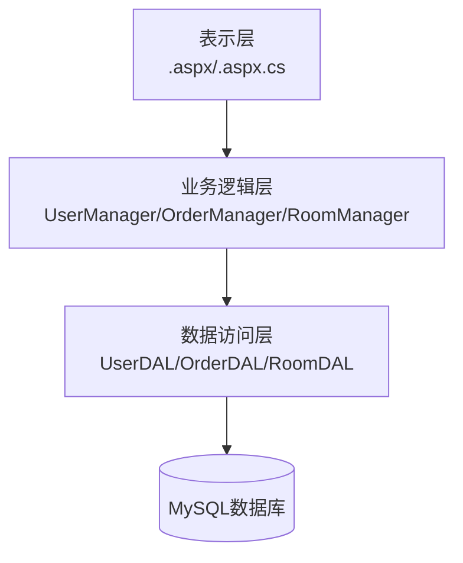

# 格林酒店管理系统分层架构设计文档

## 一、分层架构概述
本系统采用经典的三层架构设计，分为表示层（UI）、业务逻辑层（BLL）、数据访问层（DAL），各层职责明确，便于系统维护和扩展。

## 二、分层说明
- **表示层（UI）**：负责与用户交互，收集用户输入，展示处理结果。
- **业务逻辑层（BLL）**：负责处理系统的核心业务逻辑，如登录验证、订房、结算等。
- **数据访问层（DAL）**：负责与数据库进行交互，实现数据的持久化操作。

## 三、系统架构图

## 四、各层主要职责
### 1. 表示层（UI）
- 展示登录、注册、订房、管理等页面
- 调用业务逻辑层接口，传递用户输入
- 展示业务逻辑层返回的结果和提示

### 2. 业务逻辑层（BLL）
- 用户登录验证
- 订房、取消、修改、结算等业务处理
- 用户、客房、订单的增删改查逻辑
- 权限校验和流程控制

### 3. 数据访问层（DAL）
- 执行SQL语句，进行数据的增删改查
- 将数据库结果转换为业务对象
- 提供给业务逻辑层调用

## 五、功能与分层对应表
| 功能执行者   | 功能名称         | 表现层（UI）         | 业务逻辑层（BLL）      | 数据访问层（DAL）      |
| ------------ | --------------- | -------------------- | --------------------- | --------------------- |
| 系统管理员   | 登录            | Login.aspx           | UserManager.Login()   | UserDAL.GetUser()     |
| 系统管理员   | 订房功能        | OrderAdd.aspx        | OrderManager.Add()    | OrderDAL.Insert()     |
| 系统管理员   | 查询订房内容    | OrderList.aspx       | OrderManager.Query()  | OrderDAL.Select()     |
| 系统管理员   | 修改订房内容    | OrderEdit.aspx       | OrderManager.Update() | OrderDAL.Update()     |
| 系统管理员   | 取消订房        | OrderList.aspx       | OrderManager.Delete() | OrderDAL.Delete()     |
| 系统管理员   | 住宿结算        | Bill.aspx            | BillManager.Generate()| OrderDAL.Select()     |
| 系统管理员   | 添加系统用户    | UserAdd.aspx         | UserManager.Add()     | UserDAL.Insert()      |
| 系统管理员   | 查询和修改用户  | UserList.aspx        | UserManager.Update()  | UserDAL.Update()      |
| 系统管理员   | 删除系统用户    | UserList.aspx        | UserManager.Delete()  | UserDAL.Delete()      |
| 系统管理员   | 添加客房        | RoomAdd.aspx         | RoomManager.Add()     | RoomDAL.Insert()      |
| 系统管理员   | 删除客房        | RoomList.aspx        | RoomManager.Delete()  | RoomDAL.Delete()      |
| 用户         | 修改密码        | UserPwdEdit.aspx     | UserManager.ChangePwd()| UserDAL.UpdatePwd()   |
| 用户         | 修改个人信息    | UserEdit.aspx        | UserManager.Update()  | UserDAL.Update()      |
| 用户         | 预订客房        | OrderAdd.aspx        | OrderManager.Add()    | OrderDAL.Insert()     |

## 六、分层架构优点
- 高内聚低耦合，便于维护和扩展
- 职责清晰，每层只关注自己的任务
- 易于测试，可以单独测试业务逻辑或数据访问 